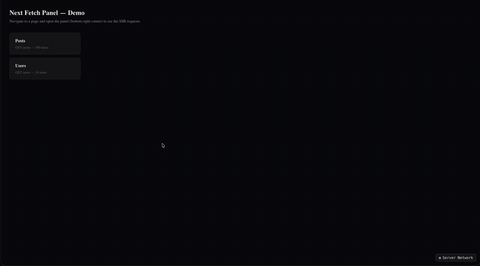

# next-fetch-panel — Example App

Live example for [`next-fetch-panel`](https://github.com/Lukazovic/next-fetch-panel), a real-time DevTools-style panel that intercepts server-side `fetch()` calls in a Next.js App Router app and streams them to a floating overlay in the browser.

**🔗 Live demo:** https://next-fetch-panel-example.vercel.app/



## What this shows

Next.js Server Components and Route Handlers run `fetch()` on the server, which is invisible to browser DevTools. `next-fetch-panel` patches `globalThis.fetch`, streams every request over SSE, and renders it in a floating panel — so you can inspect SSR network activity the same way you'd inspect client-side requests.

This repo is a minimal playground covering the main use cases:

- **`/posts`** — paginated list; every page change triggers a fresh SSR `fetch()`, visible live in the panel.
- **`/users`** — sorting triggers SSR requests made through `axios` configured with the `fetch` adapter, showing that the panel captures requests regardless of the HTTP client on top.
- **Secret redaction** — the posts page reads an API key from an env var and appends it to the request URL; the panel automatically redacts it, so the raw value never reaches the browser.
- **Session isolation** — each browser tab/session only sees its own SSR requests (see `proxy.ts`), so multiple people using the demo don't see each other's traffic.

For a deep dive into how the interception, SSE streaming, and panel UI work internally, see [DOCS.md](./DOCS.md).

## Tech stack

- [Next.js](https://nextjs.org) (App Router)
- [next-fetch-panel](https://github.com/Lukazovic/next-fetch-panel)
- [Tailwind CSS](https://tailwindcss.com)
- [axios](https://axios-http.com) (used on `/users` to demo the fetch adapter)

## Getting started

```bash
npm install
npm run dev
```

Open [http://localhost:3000](http://localhost:3000), then navigate to `/posts` or `/users` and open the panel from the bottom-right corner to watch SSR requests come in live.

## Project structure

```
app/
├── api/dev-network/       # SSE endpoint + snapshot route used by the panel
├── posts/                 # paginated SSR fetch + secret redaction demo
├── users/                 # axios (fetch adapter) SSR demo
└── layout.tsx             # mounts <DevNetworkPanel />
instrumentation.ts         # patches globalThis.fetch on server startup
proxy.ts                   # middleware: assigns/forwards the per-session id
```

## Related

- [next-fetch-panel](https://github.com/Lukazovic/next-fetch-panel) — the library this app demonstrates.
